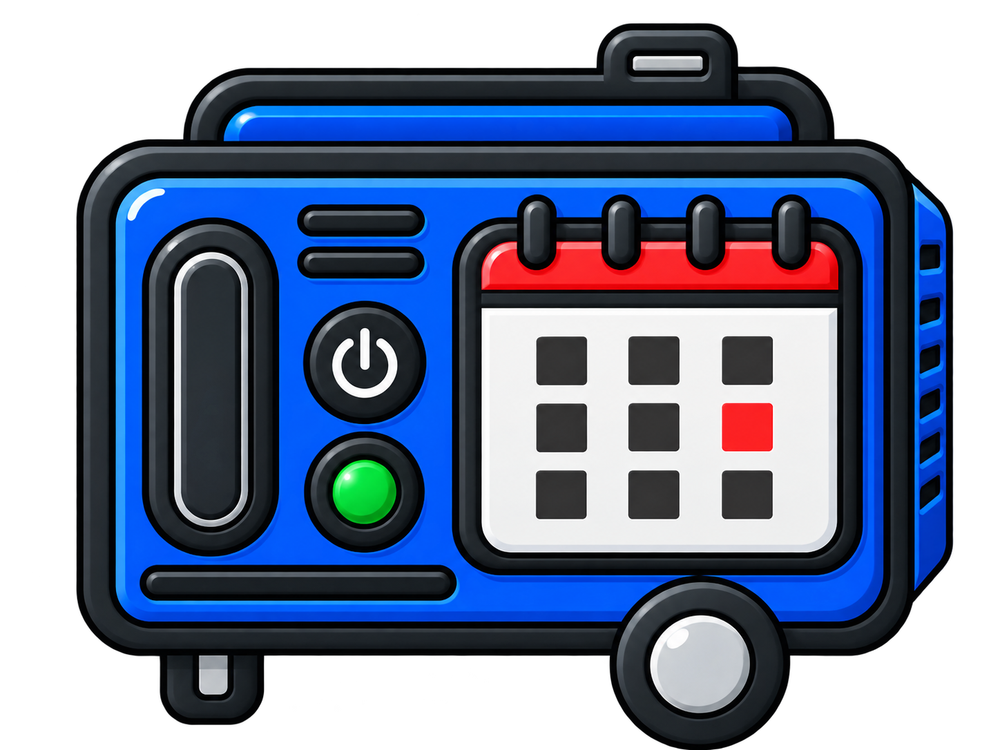

# Schedule Scanner

  

Schedule Scanner is a desktop application that converts timetable screenshots into an importable iCalendar (`.ics`) file.

The application uses OpenCV to identify the timetable structure and a local Ollama vision model to read class and teaching-week information. Users can review and edit the detected timetable before exporting it for use with Google Calendar, Outlook, Apple Calendar, and other iCalendar-compatible applications.

All screenshot processing happens locally. The application requires no API key and does not connect directly to a calendar account.

## Features

- Converts timetable and teaching-week screenshots into calendar events
- Runs vision inference locally with Ollama
- Detects weekdays from timetable geometry
- Supports PNG, JPEG, and WebP screenshots
- Provides an editable timetable review before export
- Validates dates, times, teaching weeks, required fields, and duplicates
- Creates recurring events for the correct teaching weeks
- Excludes weeks when a class does not occur
- Uses the `Europe/Dublin` timezone
- Finishes events ten minutes before their displayed timetable end time
- Caches inference results for faster repeated runs
- Exports a standard `.ics` calendar file
- Requires no hosted API, API key, or calendar-account access
